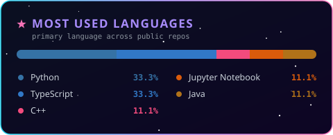
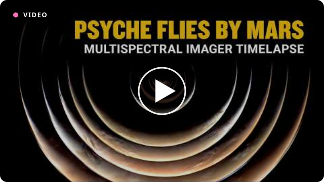

<!-- ═══════════════════════  MANN PATEL · Mann5700  ═══════════════════════ -->
<!-- Handcrafted space-themed profile. The NASA panel below auto-refreshes daily. -->



<p align="center">
  
</p>


## 🛰️ &nbsp; Mission Log - About the Captain

<table>
<tr>
<td width="56%" valign="top">

```js
const mann = {
  role      : "Full-Stack Dev + Astrophile 👽",
  homeport  : "New York Metro Sector, Earth 🌍",
  alumnus   : "Software Engineer @ UPS ",
  focus     : ["Agentic AI", "Clean UI/UX"],
  fuel      : "coffee + curiosity ☕",
  exploring : "deep-space data & generative models",
  status    : "always shipping 🚀",
};
```

</td>
<td width="44%" valign="top">

- 🛰️ &nbsp;Ask me about **GANs, Agentic AI, UI/UX**, or why Saturn has the best rings in the system.
- 🤝 &nbsp;Open to collaborate on anything that fuses **creativity with code**.
- ⚡ &nbsp;I'll happily lose a whole night to **deep-space astrophotography**. Zero regrets.

</td>
</tr>
</table>


## 🪐 &nbsp; Tech Constellation

<div align="center">

**⟡ Core Languages ⟡**


**⟡ Machine Learning & Data ⟡**


**⟡ Design, Web & Orbital Tools ⟡**


</div>


## 📡 &nbsp; Galactic Telemetry

<p align="center">
  
  
</p>

<p align="center">
  
</p>

<p align="center">
  
</p>

<p align="center">
  
</p>


## ☄️ &nbsp; Planetary Systems - Featured Missions

<table>
  <thead>
    <tr>
      <th align="left">🛰️ System</th>
      <th align="left">Mission Briefing</th>
      <th align="left">Payload</th>
    </tr>
  </thead>
  <tbody>
    <tr>
      <td><a href="https://github.com/Mann5700/Bird-Sound-Generator"><b>Bird-Sound-Generator</b></a></td>
      <td>A GAN that dreams up brand-new birdsong out of pure random noise.</td>
      <td><code>Python · Keras</code></td>
    </tr>
    <tr>
      <td><a href="https://github.com/Mann5700/Distributed-Systems-using-RMI"><b>Distributed-Systems-using-RMI</b></a></td>
      <td>Command a machine to sleep, wake, or reboot from across the network.</td>
      <td><code>Java · RMI</code></td>
    </tr>
    <tr>
      <td><a href="https://github.com/Mann5700/Avibra"><b>Avibra</b></a></td>
      <td>Turning good habits into insurance - full UX + system design study.</td>
      <td><code>Figma · Design</code></td>
    </tr>
    <tr>
      <td><a href="https://github.com/Mann5700/Network-Delay"><b>Network-Delay</b></a></td>
      <td>Charting the invisible lag between internet hosts with ping, MTR & iPerf.</td>
      <td><code>Networks</code></td>
    </tr>
  </tbody>
</table>

<div align="center"><sub>🔭 Every repo now ships with its own diagrammed flight manual - pop the hood any time.</sub></div>


## 🌌 &nbsp; Transmission from Deep Space - NASA Picture of the Day

<div align="center"><sub>📷 A fresh view of the cosmos, pulled straight from NASA's APOD API and re-transmitted here <b>every&nbsp;day</b> by a GitHub Action.</sub></div>

<!-- APOD:START -->
<h3 align="center">Psyche Receives Gravity Assist from Mars</h3>
<p align="center"><sub>🗓️ 2026-07-29 &nbsp;·&nbsp; ▶️ video of the day</sub></p>
<p align="center">
  <a href="https://www.youtube.com/watch?v=6_cH5-daLjg" target="_blank" rel="noopener noreferrer">
    
  </a>
</p>
<p align="center"><sub>Solar System bodies make deep space exploration more fuel efficient! Today’s video shows the Psyche spacecraft gaining speed and changing its trajectory with minimal fuel spent due to a gravity assist from Mars in May 2026. Mars has an average orbital speed of almost 87,000 km/h (54,000 mph) around…</sub></p>
<p align="center"><a href="https://apod.nasa.gov/apod/astropix.html">🔗 View today's full transmission on NASA APOD →</a></p>
<!-- APOD:END -->


## 🚀 &nbsp; Deep Space Network - Establish Contact

<p align="center">
  <a href="https://www.linkedin.com/in/mann5700/"></a>
  <a href="https://github.com/Mann5700"></a>
  <a href="https://github.com/Mann5700?tab=repositories"></a>
    
  <a href="https://github.com/Mann5700?tab=followers"></a>
    <a href="https://www.linkedin.com/in/mann5700/"></a>
</p>
<br/>


<div align="center"><sub>- Mann, transmitting from the Big Apple! 🍎 &nbsp;·&nbsp; <i>keep looking up.</i></sub></div>
